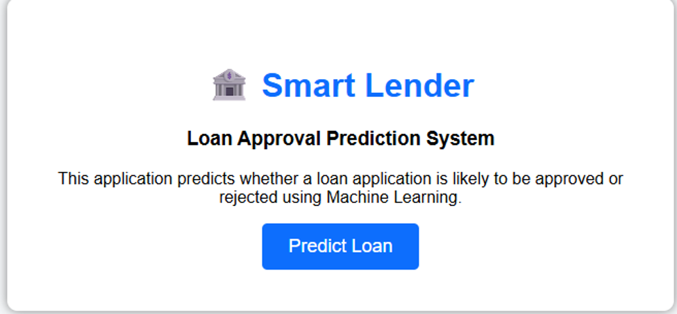
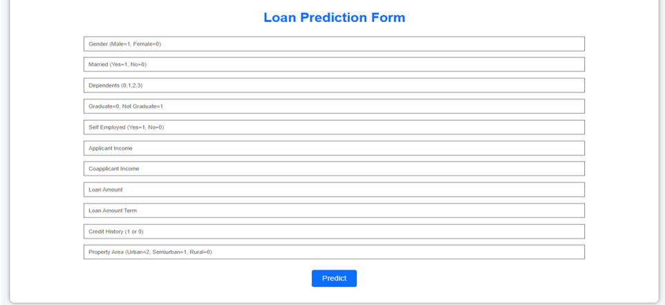
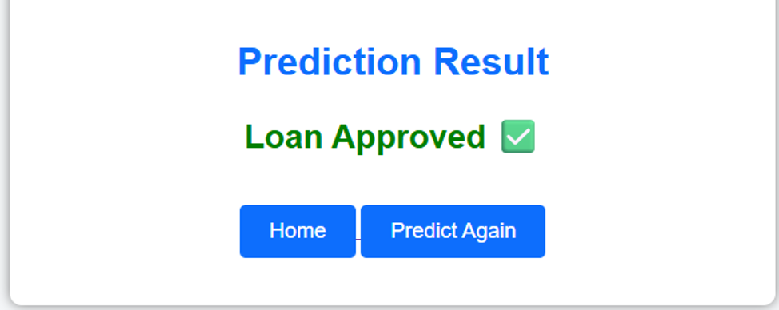

# 🏦 Smart Lender – Loan Approval Prediction System

A Machine Learning-based web application developed using Flask to predict loan approval based on applicant details. The project is deployed on Render for live access.

[](https://smart-lender-loan-approval-prediction-sg6c.onrender.com)


---

# 🌐 Live Demo

**Render Deployment**

https://smart-lender-loan-approval-prediction-sg6c.onrender.com

---

# 📸 Application Screenshots

## 🏠 Home Page

The home page welcomes users and provides access to the Smart Lender Loan Approval Prediction System.

<p align="center">

</p>

---

## 📝 Loan Prediction Form

Users enter applicant details such as gender, marital status, education, income, loan amount, credit history, and property area to predict loan approval.

<p align="center">

</p>

---

## ✅ Prediction Result

The application predicts whether the loan is approved or rejected using the trained Machine Learning model.

<p align="center">

</p>

---

# 🎯 Project Objective

The objective of this project is to develop a Machine Learning-powered web application that predicts loan approval based on applicant details. The system aims to simplify and automate the loan evaluation process by providing quick and reliable predictions through an easy-to-use web interface.

---

# 📖 Project Description

Financial institutions process numerous loan applications every day. Evaluating each application manually is time-consuming and may lead to inconsistent decisions.

The **Smart Lender – Loan Approval Prediction System** automates this process using Machine Learning. The application analyzes applicant information and predicts whether the loan is likely to be approved, helping improve efficiency and consistency in loan evaluation.

---

# ✨ Features

- Machine Learning-Based Loan Prediction
- Flask Web Application
- User-Friendly Interface
- Data Preprocessing
- Model Training and Evaluation
- Input Validation
- Responsive User Interface
- Live Deployment using Render
- Organized Project Documentation

---

# 🛠 Technology Stack

| Technology | Purpose |
|------------|---------|
| Python | Backend Development |
| Flask | Web Framework |
| Scikit-learn | Machine Learning |
| Pandas | Data Analysis |
| NumPy | Numerical Computing |
| HTML | Frontend |
| CSS | Styling |
| Git | Version Control |
| GitHub | Repository Hosting |
| Render | Cloud Deployment |

---

# 📂 Project Structure

```text
Smart-Lender-Loan-Approval-Prediction-System
│
├── 1. Brainstorming & Ideation
├── 2. Requirement Analysis
├── 3. Project Design Phase
├── 4. Project Planning Phase
├── 5. Project Development Phase
├── 6. Project Testing
├── 7. Project Documentation
├── 8. Project Demonstration
│
├── dataset
├── model
├── screenshots
├── static
├── templates
│
├── app.py
├── preprocessing.py
├── model_training.py
├── train_model.py
├── requirements.txt
├── README.md
└── .gitignore
```

---

# ⚙️ Installation

### Clone the Repository

```bash
git clone https://github.com/23ata05317/Smart-Lender-Loan-Approval-Prediction-System.git
```

### Navigate to the Project

```bash
cd Smart-Lender-Loan-Approval-Prediction-System
```

### Install Dependencies

```bash
pip install -r requirements.txt
```

### Run the Application

```bash
python app.py
```

Open your browser and visit:

```
http://127.0.0.1:5000
```

---

# 🤖 Machine Learning Workflow

- Dataset Collection
- Data Cleaning
- Exploratory Data Analysis
- Data Preprocessing
- Feature Engineering
- Model Training
- Model Evaluation
- Model Saving
- Flask Application Integration
- Loan Approval Prediction

---

# 📁 Repository Contents

This repository contains:

- Source Code
- Machine Learning Models
- Dataset
- Flask Web Application
- Project Documentation
- Testing Reports
- Demonstration Files

---

# 📂 GitHub Repository

https://github.com/23ata05317/Smart-Lender-Loan-Approval-Prediction-System

---

# 🚀 Future Enhancements

- User Authentication
- Database Integration
- Cloud Database Support
- Admin Dashboard
- Loan History Management
- Email Notifications
- Multiple Machine Learning Models
- Improved Prediction Accuracy

---

# 👥 Team Members

- **Doranala Surya Teja** (Team Lead)
- **Shaik Alfisha Maheen**
- **Shaik Sonu**

---

# 📄 License

This project was developed for **academic purposes** as part of the **SkillWallet Capstone Project**.

---

⭐ **If you found this project useful, consider giving this repository a Star on GitHub!**